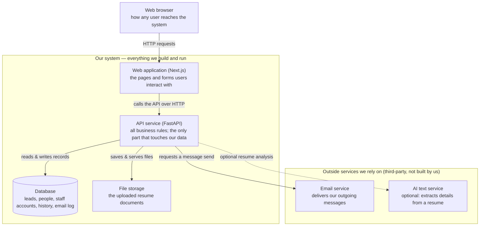
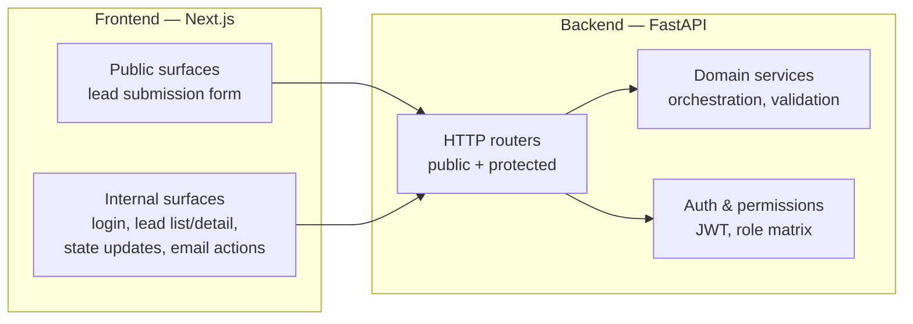
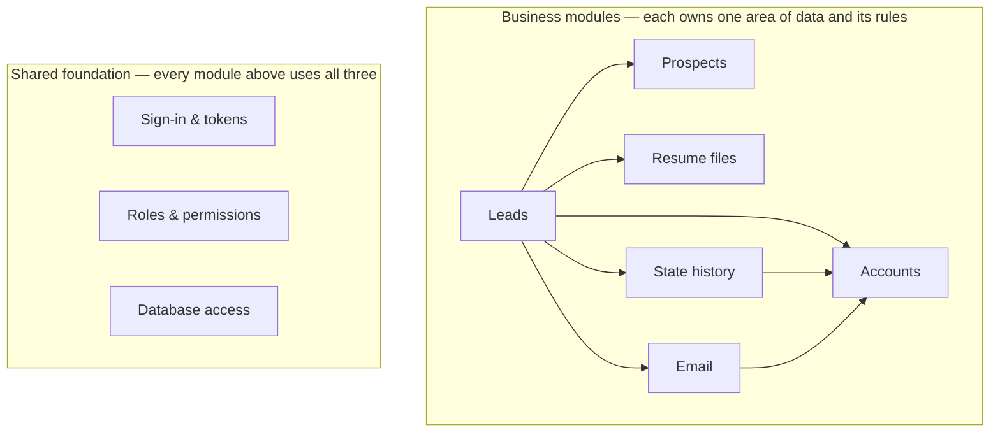
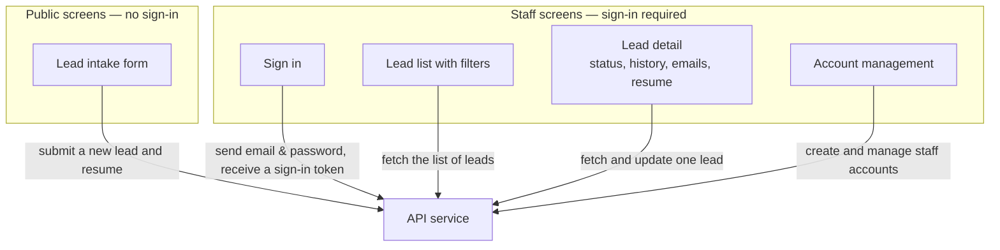
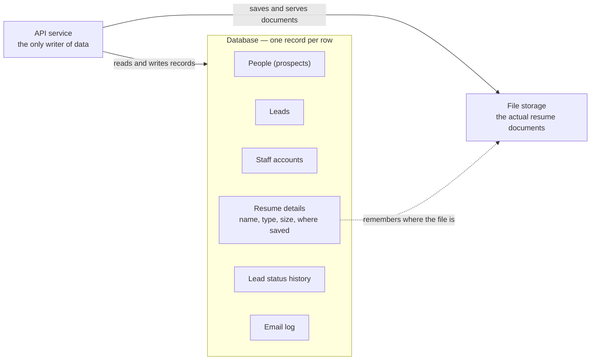
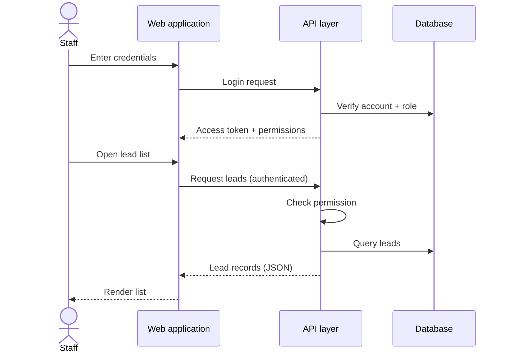
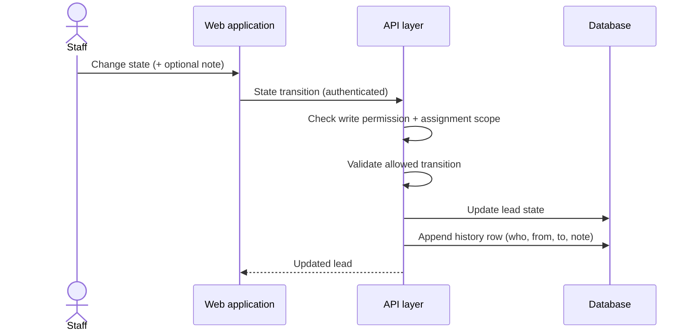
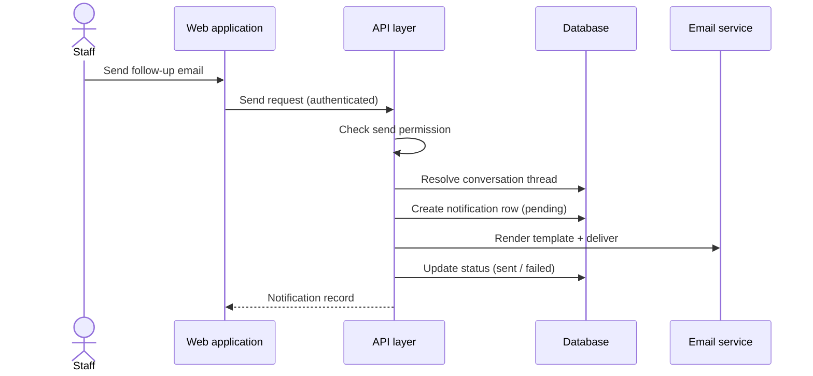
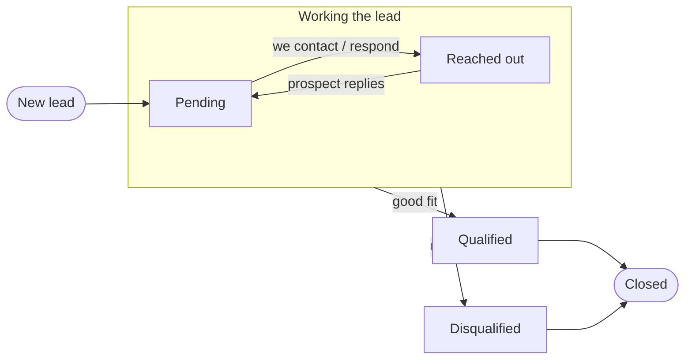
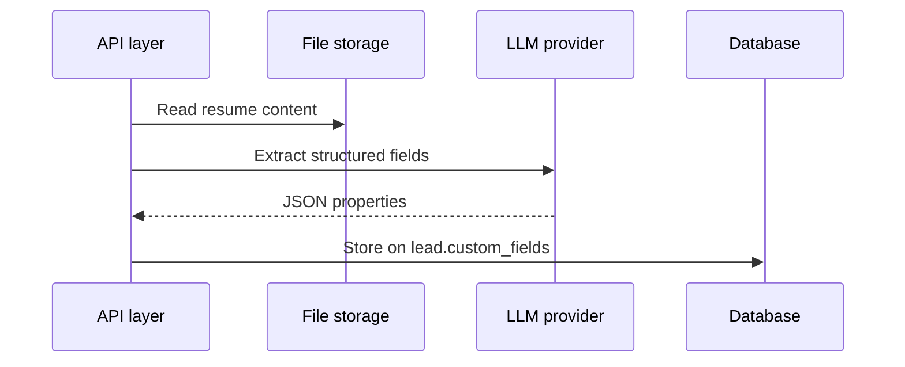

# Architecture

Architecture-relevant view of the project: requirements that drive design, domain model, technical choices, and access model. Original brief lives in `REQUIREMENTS.md`. Unspecified truths we rely on live in `ASSUMPTIONS.md`. Work still to scope lives in `FEATURES.md` (**PLAN**).

---

## System overview

The brief mandates **FastAPI** (API) and **Next.js** (web app). That is an architectural choice, not a deployment choice — it does **not** mean “everything runs locally.” Local is how we **develop and demo**; production is still the same **two-process, client–server** shape.

### What the stack implies

| Layer | Technology | Responsibility |
|-------|------------|----------------|
| **Web app** | Next.js | Public lead form, internal authenticated UI, routing, client state |
| **API** | FastAPI | REST (or similar) endpoints, auth, validation, business logic, file ingest |
| **Data** | Database + blob storage | Leads, prospects, users; resume files |
| **External** | Email provider (+ optional LLM) | Transactional mail; async enrichment |

Next.js does **not** replace the backend — it talks to FastAPI over HTTP. That forces:

- An explicit **API contract** (routes, request/response shapes, errors)
- **CORS** (and/or a BFF/proxy) when browser and API are on different origins
- **Auth across services** — token or cookie strategy shared by Next.js and FastAPI
- **File upload flow** — browser → API (multipart), API → blob storage (not “upload straight to DB from React”)
- **Two deployable units** (minimum) in any real environment

### Local vs deployed

| | Local dev | Deployed (assessment / production) |
|---|-----------|-------------------------------------|
| **Purpose** | Run locally, Loom demo, README instructions | Same architecture, reachable URLs |
| **Next.js** | `localhost:3000` | Vercel, container, or static+SSR host |
| **FastAPI** | `localhost:8000` | Container, Railway, Fly.io, etc. |
| **Database** | SQLite or Docker Postgres | Managed Postgres (or equivalent) |
| **Files** | `storage/uploads/` or MinIO | S3-compatible bucket |
| **Email** | Mailpit / Mailhog / console / real API with test key | Real transactional provider |

“Run locally” in submission guidance means **you can stand the full stack up on a developer machine** — not that the design is local-only or monolithic.

### Component diagram (summary)

See **[Architecture views](#architecture-views)** for diagrams an outsider can read without local setup details. One-line shape:

```text
Prospect / Staff → Web app (Next.js) → API (FastAPI) → Database | File storage | Email service
                                                      └ optional → LLM (enrichment)
```

### Alternative they did *not* ask for

A single **Next.js full-stack** app (Route Handlers / Server Actions only, no FastAPI) would be simpler to deploy but **violates the brief**. The mandated split is the architecture.

### Repository layout (current)

Monorepo — one Git repo, **four components**, shared docs:

```text
AlmaAssessment/
├── webapp/                     # Web application (Next.js)
│   ├── app/
│   └── lib/api.ts              # API client
├── api/                        # API service (FastAPI)
│   ├── app/
│   │   ├── core/               # config, database, deps, permissions, security
│   │   ├── domains/            # One folder per entity (account, lead, email, …)
│   │   └── main.py             # App factory, router mounts
│   └── tst/                    # Pytest tests (mirror src/domains)
├── db/                         # Database (PostgreSQL)
│   └── alembic/                # Schema migrations
├── storage/                    # File storage (resume uploads)
│   └── uploads/                # Runtime files (.gitignored)
├── docs/
├── docker-compose.yml          # Postgres + Mailpit (API/webapp run on host)
└── README.md
```

| Path | Component | Owns |
|------|-----------|------|
| `webapp/` | Web application | UI only; calls API via `NEXT_PUBLIC_API_URL` |
| `api/` | API service | HTTP API, auth, orchestration, email, optional LLM job |
| `db/` | Database | Schema migrations (Alembic); Postgres via docker-compose |
| `storage/` | File storage | Resume documents on disk (S3 adapter later) |
| `docs/` | — | Design/requirements — not runtime |
| `docker-compose.yml` | — | Postgres + Mailpit for local dev |

**Boundary rule:** the webapp never talks to the database or file storage directly — always through the API service.

---

## Architecture views

Design-level views: **what the system is made of**, **who uses it**, and **how data moves**. Implementation details (ports, local paths, route IDs) live in README and [`entities/API_CATALOG.md`](entities/API_CATALOG.md).

### 1. System architecture (the parts our project is built from)

The major pieces our project is made of and how they connect — **components, not people**. (Who does what — prospects vs. staff — is shown in [Key flows](#key-flows) and the [frontend view](#4-frontend--the-screens-people-will-use-planned), not here.) Everything inside **"Our system"** is built and run by us; the **"Outside services"** box holds third-party providers we send requests to but do not build. The single client node just shows where traffic enters; the solid arrows are everyday traffic, the dashed arrow is an optional feature.



**The one rule to remember:** the browser only ever talks to the web application, and the web application only ever talks to the API service. The database and files sit *behind* the API, and outside services are only ever reached *through* the API — nothing on the outside touches our data directly.

| Piece | Built by us? | What it is / why it exists |
|-------|--------------|---------------------------|
| **Web application** | Yes | The visible website (public form + staff screens); holds no business rules |
| **API service** | Yes | Enforces all rules and moves data; the single gatekeeper for everything below |
| **Database** | Yes (we design it) | Structured storage — leads, people, staff, history, email log |
| **File storage** | Yes (we manage it) | Keeps the actual resume documents |
| **Email service** | No — third party | Delivers the outgoing messages |
| **AI text service** | No — third party | Extracts structured details from resumes (optional) |

### 2. Application tiers

Two deployable applications in one repo. Same split in local dev and production — only hosting changes.



| Tier | Responsibility | Data it handles |
|------|----------------|-----------------|
| **Frontend** | Pages, forms, navigation, holding JWT for staff | User input; displays JSON from API |
| **Backend** | Validation, persistence, email, file I/O, permissions | All durable data; resume bytes; outbound mail |

**Transfer patterns:**

| Pattern | Where | Payload |
|---------|-------|---------|
| Lead submission | Web → API | Multipart: form fields + resume file |
| Staff reads/writes | Web → API | JSON + `Authorization: Bearer` |
| Resume download | Web → API | Binary stream (staff only) |
| Email | API → provider | Rendered message; status logged in DB |

### 3. Backend — how the API is organised inside

The API is split into one **module per area of data**. Each module owns its own records and the rules for them, and sits on a **shared foundation** that every module reuses.

Everything in the diagram is the **same kind of thing** — a backend module — and every arrow means the **same one thing:**

> **A → B means "module A calls module B while doing its job."**

**Leads** sits in the middle because creating and working a lead pulls together the person, the resume, the responsible staff member, the history, and the emails.



**What each module owns** (one area each):

| Module | The one area it owns |
|--------|----------------------|
| **Leads** | Lead records and their lifecycle |
| **Prospects** | The people who submit leads |
| **Resume files** | Uploaded resume documents |
| **Accounts** | Staff users and sign-in |
| **State history** | The audit trail of status changes |
| **Email** | Outgoing messages and their log |
| **Shared foundation** | Sign-in & tokens, roles & permissions, and database access — used by all of the above |

**Why each arrow exists** (every arrow is one module calling another):

| Arrow | Why the first module calls the second |
|-------|---------------------------------------|
| **Leads → Prospects** | To find or create the person the lead belongs to |
| **Leads → Resume files** | To store the uploaded resume and serve it later |
| **Leads → Accounts** | To pick the responsible staff member and check who may act |
| **Leads → State history** | To record the status on create and on every change |
| **Leads → Email** | To send the confirmation and the new-lead alert |
| **State history → Accounts** | To record which staff member made each change |
| **Email → Accounts** | To look up the assigned staff member's address |

The shared foundation is drawn as a separate box with no arrows, only to keep the picture clean — in practice **every** business module uses it for sign-in, permission checks, and database access.

Exact endpoints and function names: [`entities/API_CATALOG.md`](entities/API_CATALOG.md).

### 4. Frontend — the screens people will use (planned)

The web application has two groups of screens: **public** (anyone, no sign-in) and **staff** (sign-in required). Every screen gets its data by calling the API service — it never reaches the database or files itself.



| Screen | Who uses it | What it sends / gets back |
|--------|-------------|--------------------------|
| **Lead intake form** | Prospect | Sends contact details + resume; gets a confirmation |
| **Sign in** | Staff | Sends email and password; gets a sign-in token and their permissions |
| **Lead list / detail** | Staff | Gets leads (with filters); sends status or assignment changes |
| **Account management** | Admin | Creates and manages staff accounts |

**Note:** This is the planned shape. Only a placeholder home page exists today.

### 5. Where data lives

Data is kept in two places. The **database** holds structured records (one row per lead, person, etc.). **File storage** holds whole documents — the resume files themselves. The database keeps only the *details* of each resume (its name, type, and where the file is saved); the file's contents live in file storage. The API service is the only thing that writes to either.



Field-level tables and relationships: [`entities/README.md`](entities/README.md).

| Where | What it holds | Who touches it |
|-------|---------------|----------------|
| **Database** | People, leads, staff, status history, email log, and resume details | The API service only |
| **File storage** | The resume documents themselves (PDF/DOC/DOCX) | The API service: saves on upload, serves on staff download |
| **Email service** | Messages on their way out (we keep only the send status in our database) | The API service requests sends; results are logged in the database |

---

## Key flows

Conceptual sequences — **what happens**, not endpoint paths. Specs: [`entities/API_CATALOG.md`](entities/API_CATALOG.md).

### Flow A — Public lead intake (email verification required)

A lead is **not** created when the form is first submitted. The prospect must **verify their email** via a link; only then does the system create the lead, save the resume, assign staff, and send notifications.

#### Flow A1 — Submit form → verification email

```mermaid
sequenceDiagram
  actor Prospect
  participant Web as Web application
  participant API as API layer
  participant DB as Database
  participant Files as File storage
  participant Mail as Email service

  Prospect->>Web: Fill in the form and attach a resume
  Web->>API: RequestLeadVerification (form + file)
  API->>API: Validate fields and resume type/size
  API->>Files: Save resume to temporary/pending storage
  API->>DB: Store pending intake + one-time verification token (not a lead yet)
  API->>Mail: Send verification email with link containing the token
  API->>DB: Log verification email attempt
  Note over API,Mail: If verification email fails, pending intake is not confirmed —<br/>prospect sees an error; no lead exists
  API-->>Web: Report “check your email”
  Web-->>Prospect: Show check-your-email message
```

#### Flow A2 — Click verification link → lead created

```mermaid
sequenceDiagram
  actor Prospect
  participant Web as Web application
  participant API as API layer
  participant DB as Database
  participant Files as File storage
  participant Mail as Email service

  Prospect->>Web: Open link from email (token in URL)
  Web->>API: VerifyEmailAndCreateLead (token)
  API->>DB: Load pending intake by token; reject if expired or already used
  API->>DB: Look up the person by email (normalized); create if first time
  API->>Files: Promote pending resume to permanent storage
  API->>DB: Assign default staff member; create lead (status Pending) + history
  Note over API,DB: Steps in one transaction — no half-created lead
  API->>Mail: Send confirmation to prospect + alert to assigned staff
  API->>DB: Mark verification token used; log notification emails
  Note over API,Mail: If staff/prospect notification fails after lead saved,<br/>lead still exists (same as today)
  API-->>Web: Success + lead id
  Web-->>Prospect: Thank-you / confirmation page
```

**Design notes (v1):**

| Topic | Choice |
|-------|--------|
| Pending storage | New `lead_intake_pending` (or equivalent) table + temp file path until verified |
| Token | Single-use, time-limited (e.g. 24–72 h — TBD in entity doc) |
| Old Flow A | Superseded — `POST /leads` direct create replaced by **RequestLeadVerification** + **VerifyEmailAndCreateLead** |
| Staff alert timing | **After** verification (lead is real only then) |

### Flow B — Staff login and view leads



### Flow C — Staff updates lead state



### Flow D — Email: automatic vs staff-initiated

| | **On lead create** | **Staff follow-up** |
|---|-------------------|---------------------|
| Trigger | System after successful intake | Staff action in UI |
| Recipients | Prospect + assigned attorney | Per template (usually prospect) |
| Auth | Internal (no user token) | Staff token + send permission |
| Failure handling | Logged; intake still succeeds | Returned to staff as error |
| Threading | New conversation per lead + recipient | Continues or starts conversation |



### Flow E — Lead lifecycle (the statuses a lead moves through)

A lead's status is just **whose turn it is**, plus a final fit decision. The status ping-pongs between **Pending** (our turn) and **Reached out** (their turn) until staff decide the lead is a good fit or not. There is no separate "in contact" or "on hold" status — **how long a lead has been waiting** (and whether it is going cold) is read from the *time of its last status change*, not from another status.

- **Pending = our turn:** the lead is new, or the prospect just replied — we owe the next action.
- **Reached out = their turn:** we have contacted or responded — we are waiting on the prospect.
- A prospect reply flips it **back to Pending**; this repeats as often as needed.
- At any point it is the lead's turn, staff can decide **Qualified** (good fit) or **Disqualified** (not a fit). Both then **Close**.



**What each status means, and what moves a lead out of it:**

| Status | What it means (whose turn) | What causes the next move (and who decides) |
|--------|----------------------------|---------------------------------------------|
| **Pending** | **Our turn** — new submission *or* the prospect just replied; we owe the next action. | Staff contacts/responds → *Reached out*. Or staff decides fit → *Qualified* / *Disqualified*. |
| **Reached out** | **Their turn** — we have contacted/responded; we are waiting on the prospect. | Prospect replies → back to *Pending*. Or staff decides fit → *Qualified* / *Disqualified*. |
| **Qualified** | Staff decided the prospect **is a good fit** and worth moving toward engagement. | Engagement concluded → *Closed*. |
| **Disqualified** | Staff decided the prospect **is not a fit** (out of scope, no valid matter, declined, or went cold). | Closed out → *Closed*. |
| **Closed** | Final. The lead is resolved — won, lost, or abandoned. | Nothing — terminal. |

> **Why no "in contact" or "on hold" status?** They only differed by *how long* a lead sat waiting, which is the same thing as the **age of the last status change**. We store that timestamp (`state_changed_at`) and derive "waiting a while / going cold" from it — instead of asking staff to maintain extra statuses by hand. A lead that has been **Reached out** for a long time is exactly what "on hold / gone cold" used to mean.

> **Qualified vs. Disqualified** is a **human decision by staff**, not an automatic rule — made once staff understand the prospect's situation.

The same rules as a **transition table** — every status change is written to the lead's history and stamps `state_changed_at`:

| Current status | Can move to |
|----------------|-------------|
| **Pending** (our turn) | Reached out · Qualified · Disqualified |
| **Reached out** (their turn) | Pending (prospect replied) · Qualified · Disqualified |
| **Qualified** (good fit) | Closed |
| **Disqualified** (not a fit) | Closed |
| **Closed** (final) | — nothing; this is the end |

### Flow F — Optional resume enrichment

When enabled, runs after intake without blocking the prospect response.



---

## Architecture documentation — gaps & checklist

| View | Status | Notes |
|------|--------|-------|
| System context (actors + components) | **Done** | §1 |
| Application tiers (frontend vs backend) | **Done** | §2 |
| Backend logical modules | **Done** | §3 |
| Data architecture (DB vs files vs email) | **Done** | §5 |
| Key business flows | **Done** | § [Key flows](#key-flows) |
| Entity / data model (field level) | **Done** | [`entities/README.md`](entities/README.md) |
| API contract (implementers) | **Done** | [`entities/API_CATALOG.md`](entities/API_CATALOG.md) |
| Frontend sitemap + navigation | **Confirmed** | [WEBAPP_IMPLEMENTATION_PLAN.md](WEBAPP_IMPLEMENTATION_PLAN.md) — Q-W4 landing, middleware, proxy, filters |
| Auth token storage (browser) | **Confirmed** | **HttpOnly cookie** via Next auth routes — Q-W1 |
| Frontend UX decisions (Q-W2–Q-W12) | **Confirmed** | All confirmed including Q-W6 resume Next proxy |
| Failure paths (rollback, email fail, no assignee) | **Missing** | Supplement to Flow A / D |
| Production hosting diagram | **Missing** | AWS table exists; no conceptual prod view |
| Public vs protected capability matrix | **Partial** | Permissions in entity docs; no one diagram |

**Local run details** (ports, docker, env): [`WORKING_AGREEMENTS.md`](WORKING_AGREEMENTS.md) · root `README.md` — intentionally **not** in design diagrams.

**Recommended next doc tasks:**

1. ~~Frontend sitemap + auth storage decision~~ — done; implement W0–W8
2. Failure-path flows (intake rollback, email non-blocking)
3. Production deployment view (same components, different hosting)
4. Security boundary diagram (public vs staff capabilities)

---

## Requirements → architecture mapping

| Requirement (brief) | Architectural consequence |
|---------------------|----------------------------|
| Public lead form + file upload | Public API route, file validation, blob storage, no auth |
| Emails to prospect + attorney | Email adapter, templates, outbound log (recommended) |
| Authenticated internal UI | Auth layer, session/JWT, protected API routes |
| Lead state updates | State field + history/audit (recommended) |
| FastAPI + Next.js | **Separate web and API tiers** — see [System overview](#system-overview) |
| Persist data + email service | Database + external email provider (choices below) |

---

## Domain entities

Detailed schemas: [`entities/`](entities/README.md).

| Entity | Purpose | Key relationships |
|--------|---------|-------------------|
| **Prospect** | Person who may submit multiple times; anchor for communication | 1 prospect → N leads |
| **Lead** | Intake submission: fields, state, source, resume ref, `custom_fields` | N leads → 1 prospect; `assigned_account_id` |
| **Account** | Internal user (login); `role` enum immutable | Attorneys = `role=attorney`; assignment + notifications |
| **Resume file** | Stored CV + metadata (name, mime, size, storage key) | 1 resume → 1 lead (v1) |
| **Email notification** | Outbound log: recipient, template, status, `conversation_id` | Audit, retries, threading |
| **Lead state history** | Who changed state, when, from → to, optional note | Append-only audit |

**Config / constants (not entities):** feature flags (env), email templates (code/config).

**RBAC (code-only):** [Role](entities/role.md), [Permission](entities/permission.md) → `ROLE_PERMISSIONS` in `core/permissions.py`.

**Explicitly out of scope (v1):** Campaign (mass outreach), Case/Matter (see below).

---

## Lead vs case / matter

| Concept | What it is | In this project? |
|---------|------------|------------------|
| **Lead** | Pre-client intake — form submission, screening, first contact | **Yes** — core entity |
| **Case / matter** | Formal legal engagement after retention — client file, filings, deadlines, billing, opposing counsel | **No** — downstream practice-management concern |

The brief covers **individual intake processing**: submit → notify → attorney reaches out → mark state. It does not cover signing a client, opening a matter, court calendar, or document production. A lead might *become* a client/matter in a real firm, but that conversion is outside this assignment unless we explicitly expand scope.

---

## Technical choices

Decisions we make to implement the brief — not assumptions. **The brief does not specify database or hosting**; only “persist data” + FastAPI + Next.js. Those remain open until we pick them below.

### Decided

| Area | Choice | Notes |
|------|--------|-------|
| **API framework** | FastAPI | Required by brief |
| **Web framework** | Next.js | Required by brief |
| **Architecture** | Split monorepo — frontend calls API over HTTP | See [System overview](#system-overview) |
| **Auth** | JWT in FastAPI (OAuth2 password flow) | Next.js login → `/auth/token`; Bearer on internal routes |
| **Database** | PostgreSQL via docker-compose (local) | SQLAlchemy + Alembic; RDS on AWS later |
| **File storage** | `storage/uploads/` + storage interface | S3 adapter swap later |

### Recommended rationale (archived)

| Area | Why this pick | AWS equivalent |
|------|---------------|------------------|
| JWT in FastAPI | Built-in patterns; no Cognito setup | Cognito |
| PostgreSQL docker | Production-credible; one compose service | RDS / Aurora |
| Local uploads | Zero config for assessment demo | S3 |

**Auth flow (minimal):**

```text
Next.js login form → POST /auth/token (FastAPI) → JWT
Internal pages → Authorization: Bearer <token> on API calls
Public lead form → no auth
```

**Not recommended for speed (this project):**

| Option | Why skip for v1 |
|--------|-----------------|
| Cognito / Auth0 | Extra service, callback URLs, user pool setup |
| NextAuth + multiple providers | More wiring for split stack; Credentials provider still calls FastAPI |
| MinIO in docker | S3-compatible but extra container; local disk is enough for demo |
| SQLite only | Fastest boot, but weaker story for relational demo + migrations at scale |

### Who talks to what

PostgreSQL (`db/`) and `storage/uploads/` are **not** standalone products you call from the browser. **FastAPI sits in the middle** and owns all backend I/O.

```text
Next.js  ──HTTP (REST)──▶  FastAPI  ──SQL──▶       PostgreSQL (db/)
                           FastAPI  ──read/write──▶  storage/uploads/  (or S3)
                           FastAPI  ──SMTP/API──▶    Email provider
```

| Component | What it is | Who uses it |
|-----------|------------|-------------|
| **Next.js** | UI | Browser; calls **FastAPI only** |
| **FastAPI** | Your API + business logic | SQLAlchemy/psycopg → Postgres; writes files to disk; sends email |
| **PostgreSQL** | Database server (`db/` + docker locally, RDS on AWS) | **FastAPI only** — not exposed to webapp |
| **`storage/uploads/`** | File storage component (local disk) | **FastAPI** saves CV on POST; serves download via e.g. `GET /leads/{id}/resume` |

So: Postgres replaces “where rows live”; local uploads replace “where files live.” **You still implement** the FastAPI routes (`POST /leads`, file handling, etc.). Same pattern as AWS — RDS and S3 don't replace FastAPI; FastAPI uses them.

### Still open

| Area | Options | Notes |
|------|---------|-------|
| **Hosting** | Local + docker-compose for demo | Cloud optional for submission |
| **Email** | **Mailpit** (local) + **Resend** or SES (real) | Mailpit = fastest local; Resend = simple API |
| **LLM enrichment** | OpenAI API (planned) | Dummy extractor + `BackgroundTasks` queue today; flag `ENABLE_LLM_ENRICHMENT` |

---

## Roles & permissions (closed design — F6.2)

Matrix lives in [`entities/permission.md`](entities/permission.md). JWT embeds `role` + `permissions[]` at login for client UI; **route guards re-check `account.role` from the DB** on every request.

| Permission | Meaning |
|------------|---------|
| `read_leads` | View lead list, detail, resume, state history |
| `write_lead` | Update lead / state / archive — attorneys scoped to assigned leads |
| `assign_lead` | Change `assigned_account_id` |
| `read_prospect` | View prospect profile and linked leads |
| `manage_users` | Create/disable accounts |
| `send_email` | Staff-initiated email (E2, E3) |
| `read_emails` | View email audit log |
| `export_leads` | CSV export (L13) |

| Role | Typical user |
|------|--------------|
| **admin** | Firm admin — all permissions |
| **attorney** | Licensed attorney — leads + read emails + export; no assign/send/prospect |
| **intake_coordinator** | Intake staff — leads, assign, prospect, send/read email, export |
| **readonly** | Reporting — read-only across leads, prospect, emails |

**Assignment (`F6.1`):** L1 auto-assigns default `role=attorney` account with `is_default_assignee=true`; L4 override requires `assign_lead`.

---

## AWS mapping (illustrative)

If we deployed on AWS instead of local/docker, the brief’s **FastAPI** and **Next.js** map to compute/hosting layers — not to managed data or messaging services.

| Concern | AWS service (typical) | Maps to in our stack |
|---------|----------------------|----------------------|
| **Web UI** | Amplify Hosting, S3 + CloudFront, or ECS/Fargate serving Next.js | **Next.js** — pages, public form, internal UI |
| **HTTP API** | API Gateway + Lambda *or* ALB + ECS/Fargate *or* App Runner | **FastAPI** — REST, auth, business logic, file ingest |
| **Relational data** | RDS (PostgreSQL) or Aurora | **PostgreSQL** (docker locally) |
| **Resume files** | S3 | **`storage/uploads/`** (S3 adapter later) |
| **Outbound email** | SES | **Still TBD** — called from FastAPI |
| **Async LLM job** | SQS + Lambda, or background worker on ECS | **Still TBD** — triggered by FastAPI after lead create |
| **Secrets / config** | Secrets Manager, SSM Parameter Store | Feature flags, API keys |
| **Auth (optional)** | Cognito | **JWT in FastAPI** (recommended for v1) |

**Summary:** Next.js replaces a **static/SSR web host**. FastAPI replaces an **API compute tier** (Lambda or container). Database, files, email, queue, and auth provider remain **separate AWS services** — same separation as in the architecture diagram.

---

## Feature flags

Standard config — no extra entity complexity:

- `ENABLE_LLM_ENRICHMENT` — run resume extraction job
- (Future) e.g. `ENABLE_AUTO_ASSIGN` — toggle default assignment behavior

---

## Related docs

- `REQUIREMENTS.md` — original brief
- `ASSUMPTIONS.md` — unspecified truths we rely on
- `FEATURES.md` — backlog and **PLAN** items
- `entities/API_CATALOG.md` — all routes, orchestration, agent packages
- `entities/README.md` — entity index + ER diagram
- `WORKING_AGREEMENTS.md` — coordinator protocol (read after compact)
- `SESSION_CONTEXT.md` — compaction checkpoint
